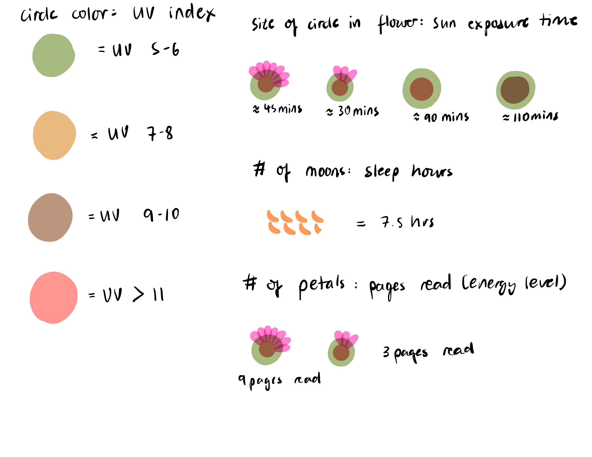
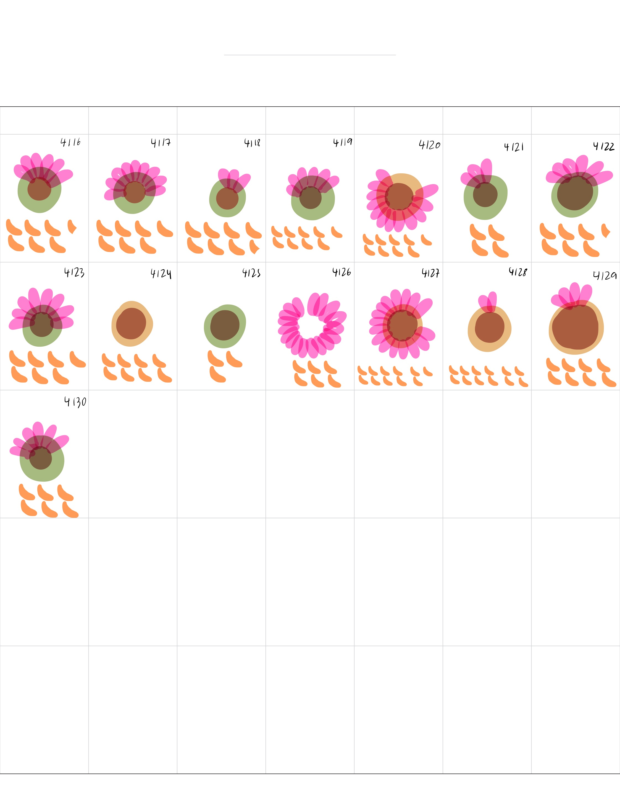
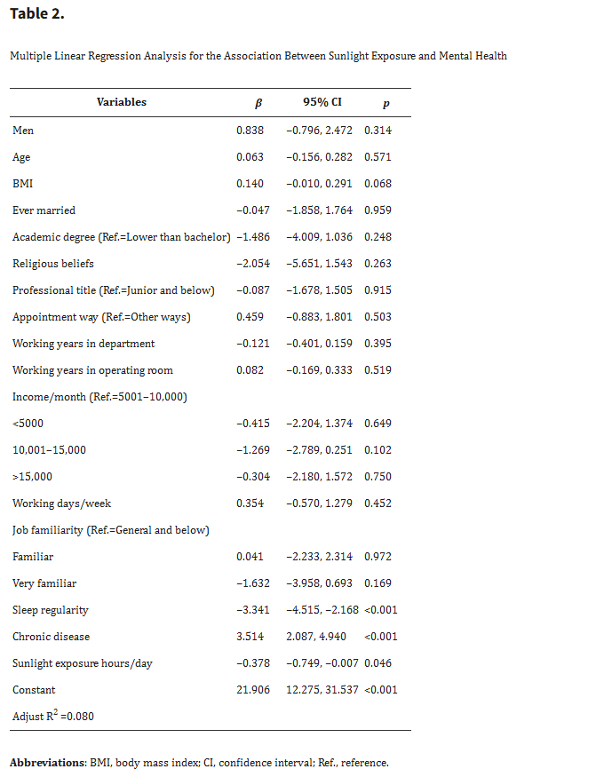

```{r}
# load packages
library(tidyverse)
library(here)
library(janitor)

# read in kelp data
kelp <- read_csv(here("data", "temp-kelp.csv"))
# read in personal dataset
my_data <- read_csv(here("data", "my_data.csv"))
```

## Problem 1

### a. An appropriate test

Two appropriate tests for evaluating the relationship between ocean temperature and giant kelp frond elongation rate are a Pearson correlation test and a simple linear regression. Both tests evaluate relationships between two continuous numerical variables, but they differ in purpose. A Pearson correlation measures the strength and direction of the linear relationship between temperature and kelp elongation rate, while a simple linear regression models how kelp elongation rate changes as temperature changes and allows prediction of the response variable from the predictor variable.

### b. Create a visualization

```{r}
# create scatterplot showing relationship between temperature and kelp growth

ggplot(kelp, aes(x = temp_c, y = kelp_elong)) +

  # add points for each observation
  geom_point(
    color = "darkgreen",
    size = 3
  ) +

  # add linear trend line
  geom_smooth(
    method = "lm",
    se = TRUE,
    color = "steelblue"
  ) +

  # relabel axes with units
  labs(
    x = "Ocean Temperature (°C)",
    y = "Kelp Frond Elongation Rate (cm/day)",
    title = "Relationship Between Ocean Temperature and Giant Kelp Growth"
  ) +

  # use cleaner theme
  theme_minimal()
```

### c. Check assumptions and run your test

#### Assumption checks

```{r}
# create linear model object
kelp_lm <- lm(kelp_elong ~ temp_c, data = kelp)

# plot diagnostic plots for assumptions
par(mfrow = c(2, 2))
plot(kelp_lm)

# perform Shapiro-Wilk test for normality of residuals
shapiro.test(residuals(kelp_lm))
```

The assumptions checked for the linear regression included linearity, normality of residuals, and homoscedasticity. I checked these assumptions using diagnostic plots from the linear model and a Shapiro-Wilk test on the residuals. Based on the diagnostic plots and test results, the assumptions appeared reasonably met for this dataset.

#### Run the test

```{r}
# run simple linear regression
summary(kelp_lm)

# run Pearson correlation test
cor.test(kelp$temp_c, kelp$kelp_elong)
```

### d. Results communication

To evaluate the strength of the relationship between ocean temperature and giant kelp frond elongation rate, I used a simple linear regression. I selected this test because both variables were continuous numerical variables, and I wanted to determine how changes in temperature were associated with changes in kelp elongation rate.

The results showed a significant negative relationship between ocean temperature and giant kelp frond elongation rate (F = 26.93, p < 0.001, R² = 0.473). As ocean temperature increased, kelp elongation rate tended to decrease. The Pearson correlation test also indicated a moderately strong negative correlation between the variables (r = -0.688, p < 0.001).

### e. Test implications

These results suggest that warmer ocean temperatures may negatively impact giant kelp growth rates. Since giant kelp forests are important marine ecosystems that provide habitat and food for many species, reduced growth under warmer conditions could have broader ecological consequences. This information could help researchers and conservation teams monitor vulnerable kelp forests and prioritize areas experiencing increasing ocean temperatures.

### f. Double check your own work

The Pearson correlation test and the simple linear regression led to the same overall conclusion about the null hypothesis. Both tests showed a significant negative relationship between ocean temperature and giant kelp frond elongation rate, with p-values less than 0.001. The Pearson correlation quantified the strength and direction of the linear relationship between the two variables, while the linear regression modeled how kelp elongation rate changed as temperature increased. Together, the tests supported the interpretation that higher temperatures were associated with lower kelp growth rates.

## Problem 2

```{r}
# clean and prepare personal dataset

my_data <- my_data %>%
  
  # clean column names
  clean_names() %>%
  
  # convert sun exposure values to numeric
  mutate(
    sun_exposure_min = na_if(sun_exposure_min, "/"),
    sun_exposure_min = as.numeric(sun_exposure_min)
  ) %>%
  
  # create EPA UV categories
  mutate(
    uv_category = case_when(
      uv_index >= 0 & uv_index <= 2 ~ "Low",
      uv_index >= 3 & uv_index <= 5 ~ "Moderate",
      uv_index >= 6 & uv_index <= 7 ~ "High",
      uv_index >= 8 & uv_index <= 10 ~ "Very High",
      uv_index > 10 ~ "Extreme",
      TRUE ~ NA_character_
    ),
    
    uv_category = factor(
      uv_category,
      levels = c("Low", "Moderate", "High", "Very High", "Extreme")
    )
  )
```

### a. Updated visualizations

#### Visualization 1

```{r}
# create bar plot of average pages read across UV categories

ggplot(
  data = filter(my_data, !is.na(uv_category)),
  aes(x = uv_category, y = pages_read, fill = uv_category)
) +

  # add bars representing group averages
  stat_summary(
    fun = mean,
    geom = "col",
    alpha = 0.8
  ) +

  # custom colors
  scale_fill_manual(
    values = c(
      "Low" = "#8dd3c7",
      "Moderate" = "#ffffb3",
      "High" = "#bebada",
      "Very High" = "#fb8072",
      "Extreme" = "#80b1d3"
    )
  ) +

  # labels and title
  labs(
    x = "UV Exposure Category",
    y = "Pages Read (pages)",
    title = "Average Pages Read Across UV Exposure Levels",
    subtitle = "Updated through May 2026"
  ) +

  # cleaner theme
  theme_classic() +

  # remove legend
  theme(legend.position = "none")
```

#### Visualization 2

```{r}
# create scatterplot of sun exposure and pages read

ggplot(
  my_data,
  aes(x = sun_exposure_min, y = pages_read)
) +

  # add observations
  geom_point(
    color = "darkgreen",
    size = 3,
    alpha = 0.7
  ) +

  # add trend line
  geom_smooth(
    method = "lm",
    se = FALSE,
    color = "black"
  ) +

  # labels
  labs(
    x = "Sun Exposure (minutes/day)",
    y = "Pages Read (pages)",
    title = "Relationship Between Sun Exposure and Pages Read",
    subtitle = "Updated through May 2026"
  ) +

  # apply non-default theme
  theme_minimal()
```

### b. Captions

Figure 1. Average pages read across EPA UV exposure categories using updated personal observations collected through May 2026. Bars represent the mean number of pages read within each UV exposure category.

Figure 2. Scatterplot showing the relationship between daily sun exposure and pages read using updated personal observations collected through May 2026. The black line represents a linear trend line.

### c. Interpretation

The updated visualizations suggest a weak negative relationship between sun exposure and pages read. In the scatterplot, higher levels of sun exposure generally appear associated with fewer pages read, although the points remain fairly dispersed. The UV category plot also shows some variation in average pages read across exposure levels, but the differences are still relatively small. With additional observations collected over a longer period, stronger patterns may become more apparent.

### d. Reflection

I imported my updated personal dataset into R by saving the spreadsheet as a .csv file and reading it in with read_csv(). One challenge I encountered was making sure that all variables were stored in the correct format, especially numerical variables like sun exposure time. I addressed these issues by cleaning the dataset using janitor and converting blank or non-recorded observations into NA values where appropriate. Some observations were intentionally left blank on days when I did not spend time in the sun and/or did not exercise.

As I continue collecting data, I would improve consistency in how I record observations and avoid leaving extra blank columns in the spreadsheet. This would help reduce cleaning time and make future analyses easier to perform.

## Problem 3

### a. Describe your affective visualization

My affective visualization will explore the relationship between sunlight exposure, reading, and daily energy levels using a layered mixed-media design. I want the piece to visually communicate how some days feel brighter, more productive, and mentally energized, while others feel slower or more drained. I plan to represent sunlight exposure using warm colors and larger visual elements, while lower-energy days will use darker or more muted tones. Rather than focusing only on statistical accuracy, the visualization will emphasize the emotional experience of balancing routines, motivation, and environmental conditions over time.

### b. Sketch

Below is a preliminary sketch outlining the visual structure and symbolism used in my affective visualization.

{width=80%}

### c. Draft visualization

Below is a draft version of my affective visualization using my personal sunlight, sleep, and reading data.

{width=80%}

### d. Artist statement

The content of my piece focuses on the relationship between sunlight exposure, sleep, and reading behavior over time. Each flower represents a single day, with different visual components encoding environmental and behavioral variables such as UV exposure, pages read, and sleep duration.

I was influenced by affective visualization projects such as Dear Data and other hand-drawn visualizations that emphasize emotional experience and personal routine rather than strict statistical presentation. I also wanted the piece to feel organic and somewhat imperfect to reflect the variability of daily life.

The form of my work is a hand-drawn mixed-media illustration using digital drawing tools and symbolic visual elements. I used flower imagery because it naturally connects to sunlight, growth, energy, and environmental conditions.

My process involved first sketching a visual key to determine how each variable would be represented. I then translated daily observations into flower forms whose size, petal count, color, and surrounding symbols varied according to the collected data.

### e. Workshop presentation slides

View my Google Slides presentation here:

[Workshop Presentation Slides](https://docs.google.com/presentation/d/147f197dbJyHSDZ6Ct5brqgQrDQJ-vZzsyhHfEL4e-ZM/edit?usp=sharing)

## Problem 4

### a. Revisit and summarize

The paper I chose examined the relationship between sunlight exposure and mental health among operating room nurses. The authors used multiple linear regression to evaluate how different predictor variables, including sunlight exposure hours per day, sleep regularity, and chronic disease, were associated with mental health measured by K10 score. In Homework 2, I focused on Table 2, which summarized regression coefficients, 95% confidence intervals, and p-values for the predictors. 

{width=80%}


